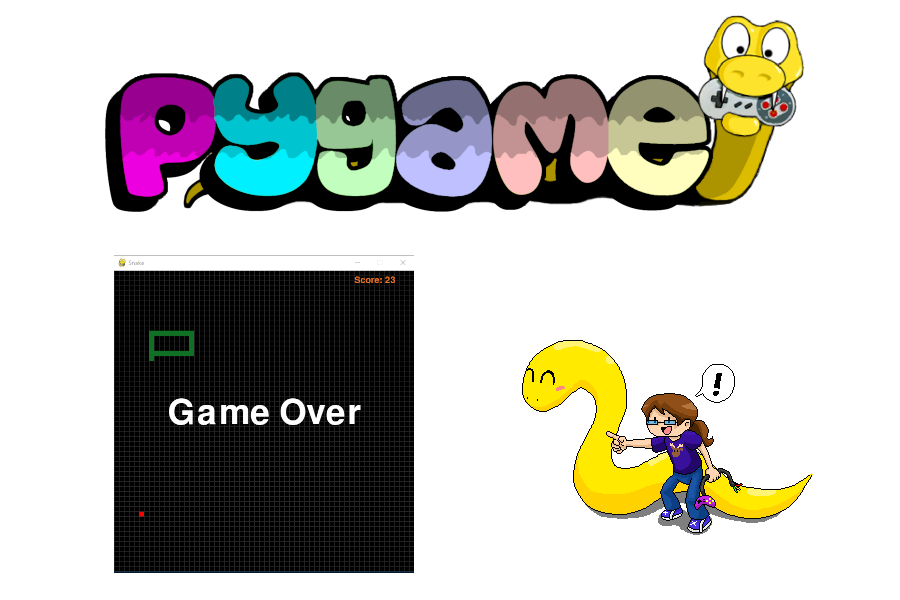
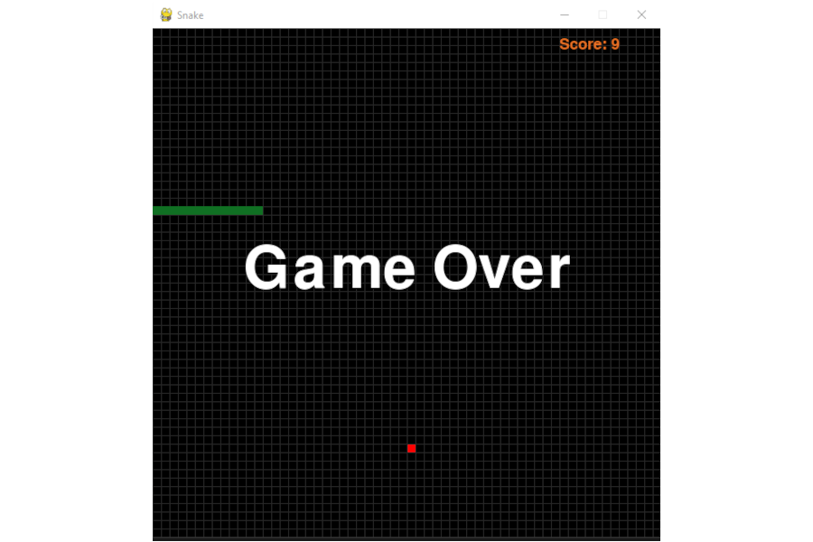

# pygame
# Programa Desenvolvido em Python 03
# Projeto Snake Game — Jogo da Serpente

 

Estou desenvolvendo este projeto para aprender mais sobre desenvolvimento de jogos utilizando como ferramenta o <strong>Pygame</strong> que é uma biblioteca de jogos multiplataforma feita para ser utilizada em conjunto com a linguagem de programação Python. 

<strong>Snake</strong> (Serpente, também conhecido como “jogo da cobrinha”) é um jogo que ficou conhecido por inúmeras versões com diversas imitações em videogames e computadores. O jogo foi lançado para celulares Nokia em 1998 e se tornou muito popular, inclusive no Brasil. 
O jogador controla uma longa e fina serpente que se arrasta pela tela, coletando comida (ou algum outro item), não podendo colidir com seu próprio corpo ou as “paredes” que cercam a área de jogo. Cada vez que a serpente come um pedaço da comida, sua cauda cresce, aumentando a dificuldade do jogo. O jogador controla a direção da cabeça da serpente (para cima, para baixo, esquerda e direita).
 

 

<strong>1º Passo:</strong> Criei uma janela vazia com o código base para o jogo. 
screen = pygame.display.set_mode((600, 600)) 

<strong>2º Passo:</strong> Desenhei a serpente estática na tela.
Ela é um conjunto de coordenadas (X, Y). Utilizei o tamanho de cada “pixel” (10x10), ou seja cada parte da serpente são quadradinhos de 10 x 10. 
A serpente possui 5 segmentos nas posições: [(200,200), (210,200), (220,200), (230,200), (240,200)].
Cada quadrinho da serpente é representado por um Surface do pygame. O pygame.Surface — objeto que recebe em seu construtor seu tamanho (Width, Height). Também tem o método fill que recebe como argumento uma sequência RGB (no caso recebeu a sequência (16, 112, 35) uma tonalidade de verde. 

Antes de desenhar qualquer coisa na tela é importante limpar a mesma. O objeto Display do pygame possui um método screen.fill((0,0,0)) para limpar atela.
Para desenhar a serpente deve-se iterar por todas as duas coordenadas e utilizar o método blit (surface,pos) do display para desenhar a pele da cobrinha (Surface) em uma determinada posição. 

<strong>3º Passo:</strong> para fazer com que a serpente se movimente, modifiquei as coordenadas que a definem de acordo com os 5 segmentos já mencionados para ela se mover para a esquerda, por exemplo, as coordenadas devem ficar [(190,200), (200,200), (210,200) (220,200), (230,200)]. Isso significa que, iniciando da posição mais à direita da serpente, cada posição recebe as coordenadas da posição imediatamente anterior e a última posição (como não existe posição anterior a ela) nesse caso se move 10 para a direita (o que significa subtrair 10 da coordenada x). 
Defini macros para o movimento da serpente que representam as posições:
UP = 0
RIGHT = 1
DOWN = 2
LEFT = 3 
A serpente deve começar o jogo com uma direção pré-definida. Como as nossas coordenadas estão crescendo para a direita, isso significa que a “cabeça” (início) da nossa serpente está do lado esquerdo, por isso ela deve começar andando para a esquerda (my_direction = LEFT). Isso pode variar de acordo com as coordenadas que definem a sua serpente. Mas ela deve começar o jogo andando na direção da sua cabeça. - Para que a cobrinha se movimente deve-se modificar suas coordenadas de acordo com a direção. Para selecionar a direção com o teclado existe um evento no pygame semelhante ao QUIT que é o KEYDOWN. As opções interessantes de teclas para nosso caso estão armazenadas em event.key e podem ser: K_UP, K_DOWN, K_LEFT, K_RIGHT. 

<strong>4º Passo:</strong> Acrescentei um clock. Ao fazer a serpente se movimentar no passo anterior  gerou um movimento muito rápido e para consertar esse problema devemos adicionar um clock de forma que a tela só seja redesenhada depois de um certo tempo, fazendo com que a serpente se mova mais lentamente: clock = pygame.time.Clock(). 

<strong>5º Passo:</strong> Desenhei a maça na tela. Como foi definido que nossos quadrinhos são 10x10 esse também será o tamanho da nossa maçã. Importante que a maçã deve ser desenhada dentro dos limites da tela. Como a nossa tela é (600x600) a última coordenada x e y que a maçã pode obter é 590 (pois ela possui tamanho 10). Criei uma função para obter as coordenadas dentro dos limites estabelecido. A maçã tem que ser desenhada alinhada com a cobra e as funções/objetos (Surface, fill e blit.) são relevantes para esse passo. Claro que a cor da maçã é vermelha representada em RGB por (255,0,0).  
  
<strong>6º Passo:</strong> A serpente deve colidi com a maçã para comer a mesma e “crescer” um segmento. 
Implementei uma função para detectar se a cabeça da cobra colidiu com a maçã.  
  
<strong>7º Passo:</strong> Adicionei detecção de colisão da cobra com a janela do jogo e com seu corpo. Para esse passo devemos identificar se a cabeça da cobra atingiu os limites da janela (nossas coordenadas vão de 0 a 600 nos eixos x e y). Quando ocorrer a colisão o jogo deverá ser encerrado com (pygame.quit() e exit()) com uma tela de Game Over. 
  
<strong>8º Passo:</strong> Adicionei linhas de grid em nossa janela para marcar os segmentos. A cada 10 unidades na vertical e na horizontal desenhei uma linha utilizando uma função. 

<strong>9º Passo:</strong> Adicionar score(pontos). Inicialmente o jogador começa com 0 ponto. Cada maçã representa um ponto (ou quantos pontos forem definidos). Para adicionar o score deve-se utilizar o módulo pygame.font, que é um módulo para carregar e renderizar fontes. game_over_font = pygame.font.Font('freesansbold.ttf', 70). Criar um variável para fazer a contagem de pontos que inicia com 0 e é somada a cada vez que a cobra colide com a maçã. - Utilizar o método pygame.font.Front.render(text, antialias, color) para desenhar um texto em uma superfície. Antialias é um bool que define se os caracteres devem ter as bordas suavizadas if true the characters will have smooth edges. A função get_rect do objeto Font retorna um retângulo que deverá ser posicionado na tela utilizando o método topleft(x, y).  

<strong>10º Passo:</strong> Adicionei um texto de Game Over para ser utilizado no lugar de simplesmente fechar o jogo quando a cobra colide com as bordas ou consigo mesma. Utilizei novamente o objeto Font. - Outro local para a localização do retângulo com o texto pode ser o (game_over_rect.midtop = (600 / 2, 250)) - Criar um loop fora do loop principal do jogo para ficar imprimindo a tela de Game Over até o evento de quit. - Funções de ajuda: pygame.display.update(), pygame.time.wait(500).

## Como Executar um Script Python?

Para instalar o Python no seu sistema operacional Windows, você precisa baixar o instalador. Acesse o site oficial <a href="https://www.python.org/downloads/" target="_blank">neste link</a> e clique em download.
 

Para executar um script Python na linha de comando, ele precisa estar gravado em um arquivo com a extensão “.py”. Abra o prompt de comando no Windows, ou o terminal no Linux/MacOS, e digite python nome do arquivo.py lista de argumentos. Para que isso funcione, o interpretador Python precisa estar instalado na máquina e seu caminho deve estar configurado na variável PATH, fazendo com que o arquivo executável python esteja acessível a partir da linha de comando.

## Como instalar o Pygame pelo PIP?

Depois de instalar o Python, instale o PyGame por meio da linha de comando (ou do terminal no VS Code) digitando python -m pip install -U pygame --user . Se tudo estiver certo, o jogo abrirá uma janela. Feche a janela quando terminar de jogar.
 

## IMPORTANTE:

Você tem todo o direito de usar esse material para seu próprio aprendizado. Espero que seja útil o conteúdo disponibilizado.
 

